# ActFormer - Human Motion Generation Project

Bu proje, [ActFormer: A GAN-based Transformer towards General Action-Conditioned 3D Human Motion Generation (ICCV 2023)](https://github.com/Szy-Young/actformer) çalışmasından esinlenilmiş olup, orijinal mimari üzerinde modifikasyonlar ve iyileştirmeler yapılarak geliştirilmiştir. ActFormer tabanlı bu yapı, verilen etiketlere göre gerçekçi 3D robot hareketleri üretir.

## Görselleştirme ve Demo (K18 Test Kişisi)

Aşağıda, modelin K18 test kişisi üzerinde ürettiği 15 farklı aksiyonun **en düşük FID skoruna sahip** (en başarılı) örnekleri yer almaktadır. Sol taraf gerçek hareketi, sağ taraf modelin ürettiği hareketi göstermektedir.

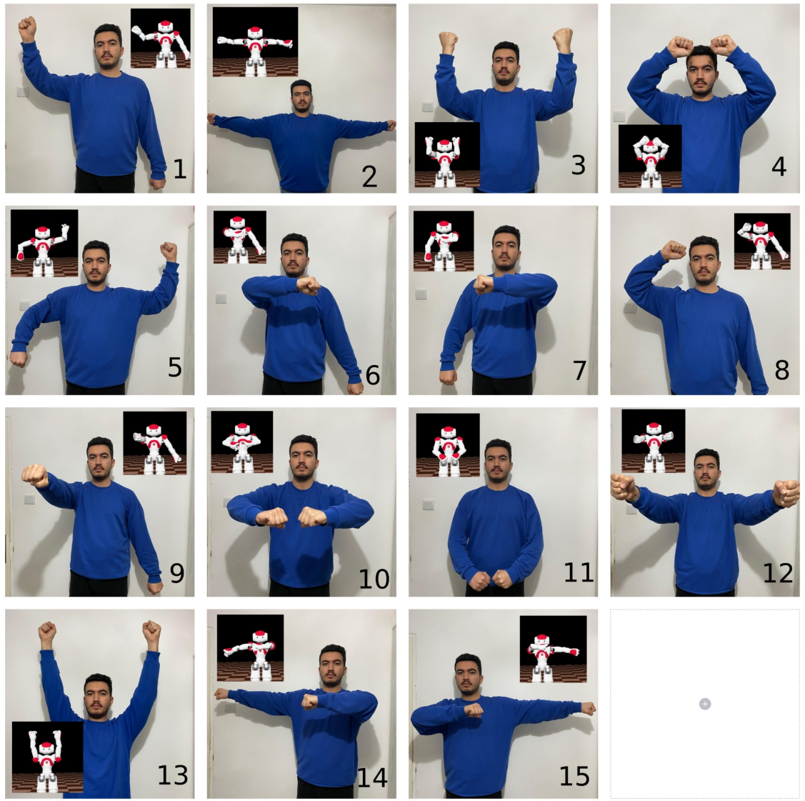

| Aksiyon | Karşılaştırma (Real vs Fake) | Aksiyon | Karşılaştırma (Real vs Fake) |
| :--- | :--- | :--- | :--- |
| **A001** | 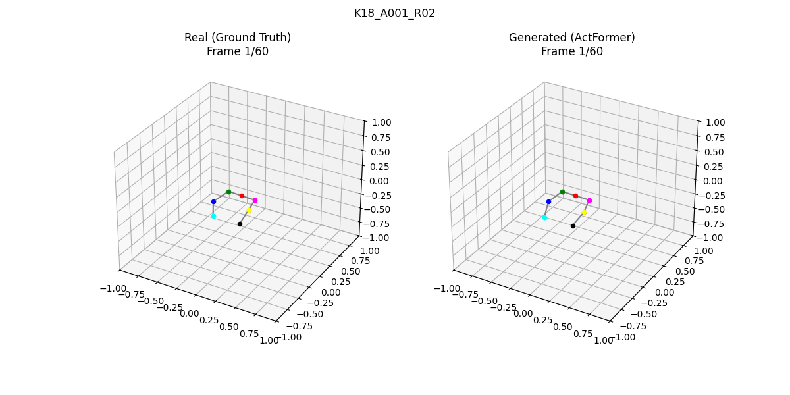 | **A002** | 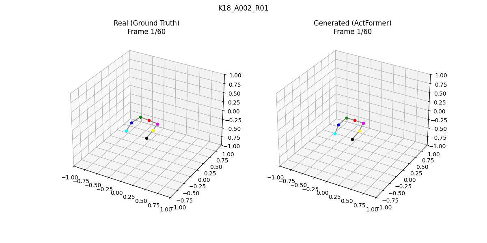 |
| **A003** | 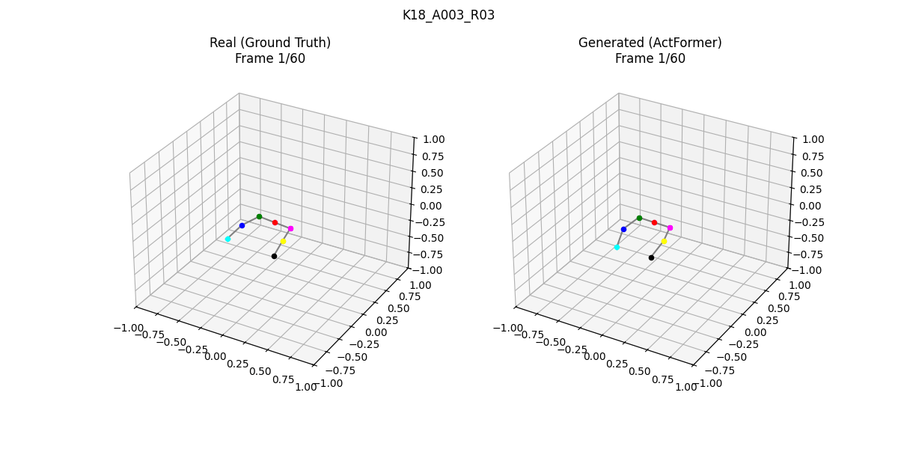 | **A004** | 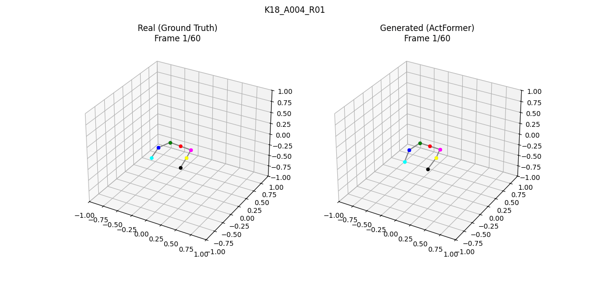 |
| **A005** | 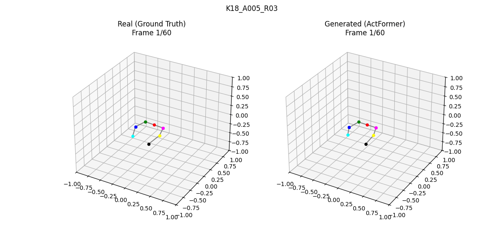 | **A006** | 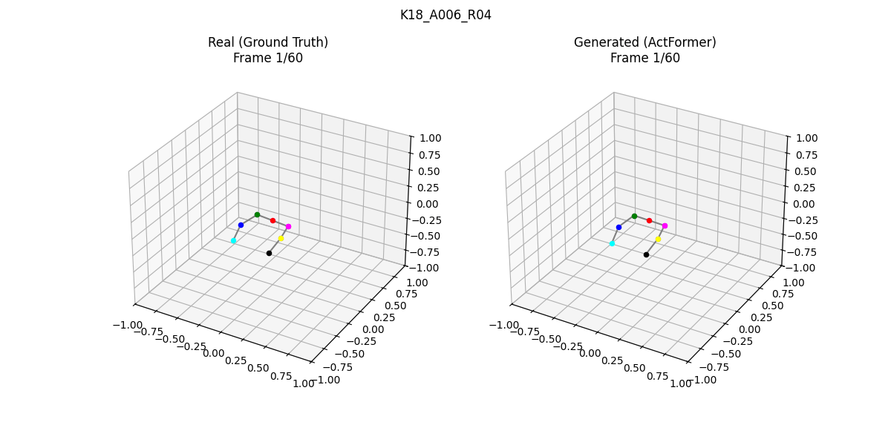 |
| **A007** | 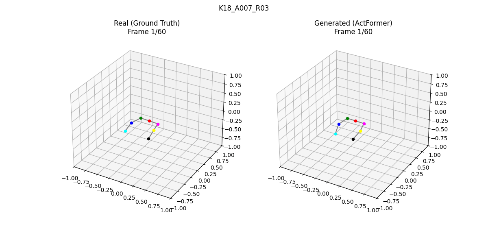 | **A008** |  |
| **A009** | 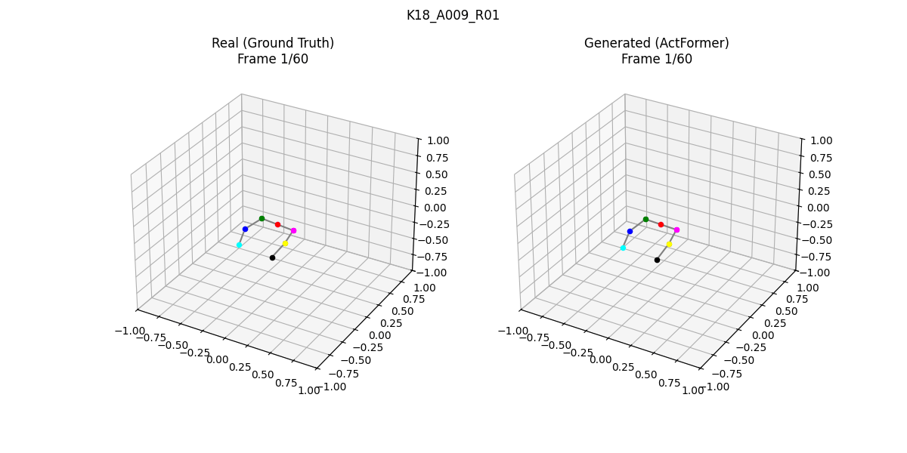 | **A010** | 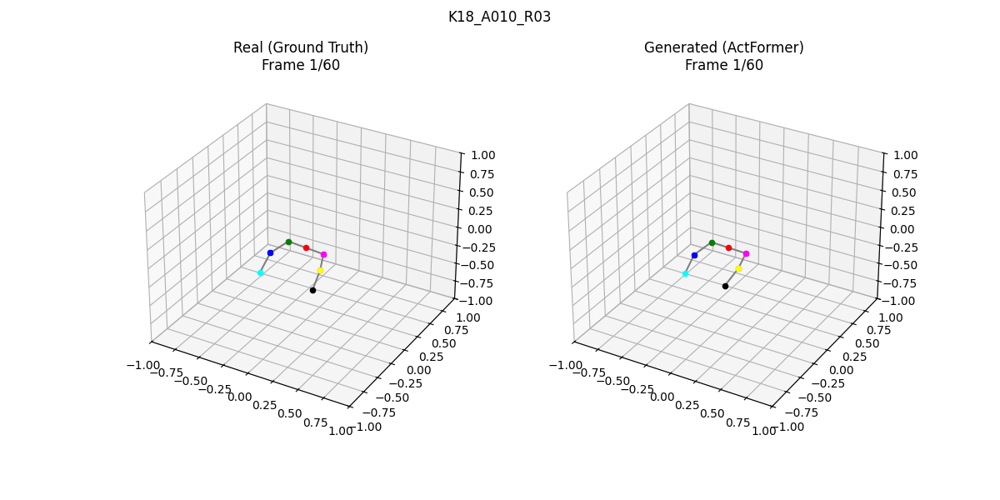 |
| **A011** |  | **A012** | 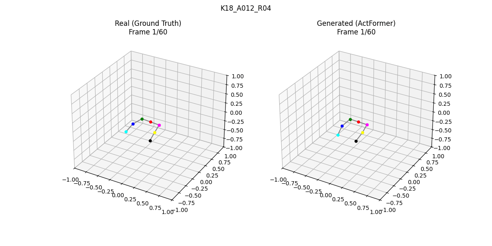 |
| **A013** | 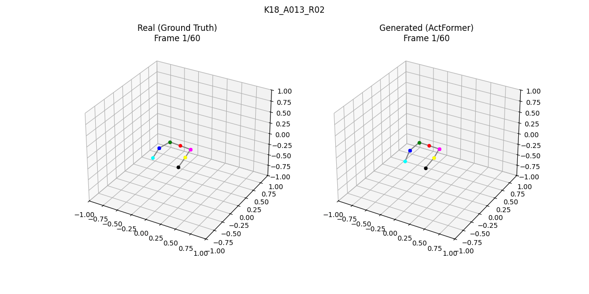 | **A014** |  |
| **A015** |  | | |

---

## Desteklenen Veri Setleri

| Veri Seti | Klasör / Path | Joint | Frame | Sınıf | Veri Formatı |
|-----------|--------|-------|-------|-------|-------------|
| **NAO Robot** | `Dataset/HDF5_Dataset_60frame/` | 7 | 60 | 15 | HDF5 |
| **NTU RGB+D 49** | `NTU49_7J/` (xsub / xview) | 7 | 64 | 49 | npy + pkl |

---

## NAO Pipeline

### Çalıştırma Sırası
```bash
python main.py              # 1. GAN eğitimi
python test_final.py         # 2. Sahte hareket üretimi (Train & K18)
python train_evaluator.py    # 3. FID encoder eğitimi
python fid.py                # 4. Global FID hesaplama (Train)
python fid_k18.py            # 5. K18 Test Kişisi FID hesaplama
python visualize_k18_comparison.py # 6. Görselleştirme (GIF)
```

### Dosya Yapısı
*   **main.py**: GAN modelini (Generator + Discriminator) eğitmek için kullanılan ana dosyadır. Kayıpları (GAN, L1, Bone, Center) hesaplar ve modelleri kaydeder.
*   **net_G.py**: Generator (Üretici) model mimarisini içerir. Transformer tabanlıdır.
*   **net_D.py**: Discriminator (Ayırt Edici) model mimarisini içerir. ST-GCN yapısındadır.
*   **data_loader.py**: HDF5 veri setini yükler. Test verisi olarak varsayılan 'K18' kişisini ayırır.

### Değerlendirme ve Genelleme Testleri
*   **train_evaluator.py**: FID hesabı için 15 sınıflı Action Classifier eğitir.
*   **test_final.py**: Modelden istatistiksel analiz için 1000+ hareket dizisi üretir. (Output: Full_Train_Generation)
*   **fid.py**: Tüm train dosyalarından üretilen test setinin Global FID skorunu ve genel per-sequence raporunu hesaplar.
*   **fid_k18.py**: K18 test kişisi için Global FID hesaplar ve detaylı per-sequence CSV raporu üretir.
*   **visualize_k18_comparison.py**: Gerçek ve üretilen hareketleri yan yana (Side-by-Side) GIF olarak görselleştirir.

### Final Başarı Metrikleri (Phase 2)

| Metrik | Kapsam | Değer |
| :--- | :--- | :--- | 
| **FID_m ↓** | Train Kayıtları (1080 Seq) | **1.1096** |
| **FID_m ↓** | K18 Test Kişisi (60 Seq) | **3.8924** |
| **FID_w ↓** | K18 Test Kişisi | **13.5031** |
| **ACC ↑** | K18 Test Kişisi | **100%** |
| Ortalama FID (Sıralı) | Train Kayıtları | 17.3030 |
| Ortalama FID (Sıralı) | K18 Test Kişisi | 9.7693 |

---

## NTU49_7J Pipeline

NTU RGB+D 60 veri setinin **49 aksiyon**, **7 joint** versiyonu. Aynı model mimarisi (ActFormer Generator + GCN Discriminator) kullanılır.

### Çalıştırma Sırası
```bash
cd NTU49_7J
python main.py              # 1. GAN eğitimi
python check_best_model.py   # 2. En iyi model seçimi
python test_final.py         # 3. Sahte hareket üretimi
python train_evaluator.py    # 4. FID encoder eğitimi
python fid.py                # 5. FID hesaplama
python visualize_comparison.py # 6. Görselleştirme
```

| Dosya | Açıklama |
|-------|----------|
| `main.py` | GAN eğitim scripti (49 sınıf, T=64) |
| `check_best_model.py` | En iyi model seçimi |
| `test_final.py` | Sahte hareket üretimi |
| `train_evaluator.py` | FID encoder eğitimi |
| `fid.py` | Global + per-sequence FID hesaplama |
| `visualize_comparison.py` | Gerçek vs Sahte görselleştirme |
| `data_loader_ntu.py` | npy/pkl veri yükleme modülü |

### Final Başarı Metrikleri

| Metrik | Kapsam | Değer |
| :--- | :--- | :--- | 
| **FID_m ↓** | NTU49 Val (xsub) | **34.7** |
| **FID_w ↓** | NTU49 Val (xsub) | **228.5067** |
| **ACC ↑** | NTU49 Val (xsub) | **58.5%** |


> Detaylı bilgi için: [NTU49_7J/README.md](NTU49_7J/README.md)

---

## Ortak Model Mimarisi
*   Mimari: ActFormer (12 Layer Transformer, 64 Embed-Dim-Ratio, 14 Heads).
*   Kayıp Fonksiyonları: Hinge GAN Loss + 10.0x L1 Reconstruction Loss + R1 Regularization.
*   Örneklem: Tüm analizler istatistiksel kararlılık için 1000+ örneklem üzerinden yapılmıştır.

---

## Klasör Yapısı

```
Actformer_Nao/
├── main.py, net_G.py, net_D.py, ...      # NAO pipeline
├── Dataset/                                # NAO veri seti (HDF5)
├── Results/                                # NAO sonuçları
│   ├── saved_models/
│   ├── Full_Train_Generation/
│   └── fid_encoder.pt
└── NTU49_7J/                               # NTU pipeline
    ├── xsub/, xview/                       # NTU veri seti (npy/pkl)
    ├── main.py, test_val.py, ...         # NTU scriptleri
    └── Results/                            # NTU sonuçları
        ├── saved_models/
        └── fid_encoder.pt
```

---

Bu çalışma, Türkiye Bilimsel ve Teknolojik Araştırma Kurumu (TÜBİTAK) tarafından 123E635 numaralı proje ile desteklenmiştir. Projeye verdigi destekten ötürü TÜBİTAK’a teşekkürlerimizi sunarız.

---

## Yayınlar (Papers)

*   **NAO and Expert Imitating Each Other: A New Robot Action Dataset**  
    [İncele (IEEE Xplore)](https://ieeexplore.ieee.org/abstract/document/11112493)

---

## Atıf (Citation)

Eğer bu projeyi veya veri setini araştırmalarınızda kullanırsanız, lütfen aşağıdaki şekilde atıfta bulunun:

```bibtex
@inproceedings{ccoban2025nao,
  title={NAO and Expert Imitating Each Other: A New Robot Action Dataset},
  author={{\c{C}}oban, Ali and Sari, Serhat Ula{\c{s}} and Karada{\u{g}}, {\"O}zge {\"O}ztimur and {\"O}zyer, Bar{\i}{\c{s}}},
  booktitle={2025 33rd Signal Processing and Communications Applications Conference (SIU)},
  pages={1--4},
  year={2025},
  organization={IEEE}
}
```

---

## Proje Kapsamında Yapılan Diğer Çalışmalar

*   **AGMS-GCN: Attention-guided multi-scale graph convolutional networks for skeleton-based action recognition**  
    [İncele (ScienceDirect)](https://www.sciencedirect.com/science/article/pii/S0950705125000929) | [GitHub Repository](https://github.com/ugrkilc/AGMS-GCN)

---

## Lisans (License)

Bu proje [MIT](LICENSE) lisansı altında lisanslanmıştır.

